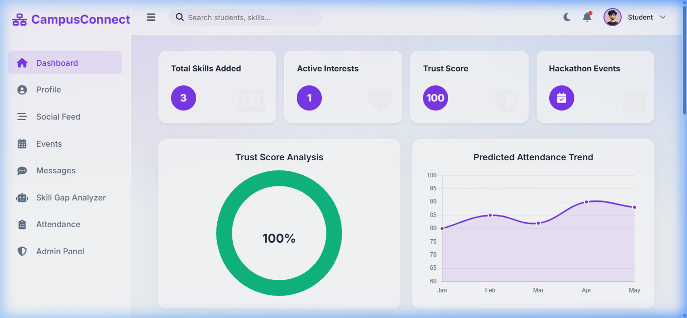
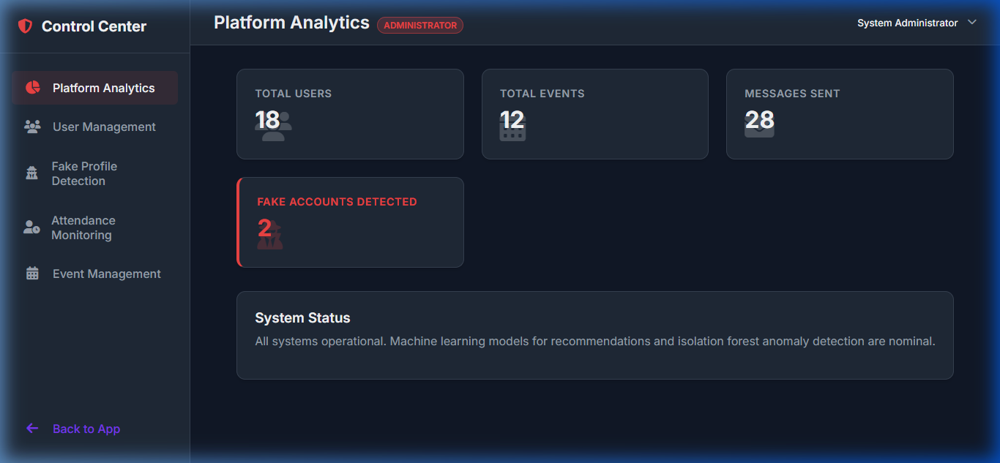

# CampusConnect AI

A full-stack Smart Campus Social Networking System built for college students to connect, find project partners, and create events. Features an AI-powered smart matching system (Cosine Similarity) and fake profile detection (Isolation Forest).

## Project Structure
- `backend/` - Python Flask API, SQLite database, and Scikit-Learn ML models.
- `frontend/` - Modern Glassmorphism Single-Page Application (HTML/CSS/JS).

## How to Run locally

### 1. Start the Backend API
1. Open a terminal in the `backend/` directory.
2. Activate the virtual environment: `.\venv\Scripts\activate` (Windows) or `source venv/bin/activate` (Mac/Linux).
3. (Optional) Run the seed script to reset data: `python seed.py`
4. Start the server: `python app.py`
5. The API will run on `http://127.0.0.1:5000`.

### 2. Start the Frontend Application
Since the frontend is a Vanilla JavaScript application using the Fetch API with absolute paths to localhost, you can simply open the `index.html` file in your browser.
1. Navigate to the `frontend/` directory.
2. Double click the `index.html` file to open it in Chrome/Edge/Firefox.

## Demo Flow 
1. **Login**: Use the `Demo Student` quick-login button (`student1@college.edu` / `password123`).
2. **Dashboard**: Show the AI Recommendations section. Notice the Match % based on skill vectors.

3. **Events**: Navigate to Events, create a new Hackathon event, and click to join existing ones.
4. **Chat**: Show the messaging module allowing seamless communication with peers.
5. **Admin & Anomaly Detection**:
   - Login using the System Administrator credentials (`admin@university.edu` / `adminpassword`).
   - You will be redirected to the **Admin Control Center**.
   - Navigate to **Fake Profile Detection** and click **Execute System Scan** to trigger the Isolation Forest model.
   - View active trends in the **Platform Analytics** tab.

*Built with Flask, Vanilla JS, and Scikit-Learn.*
